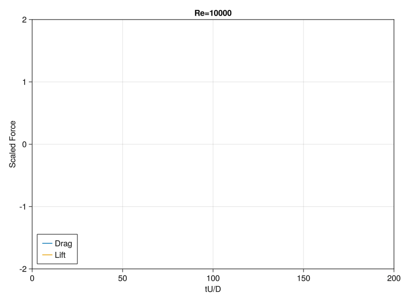
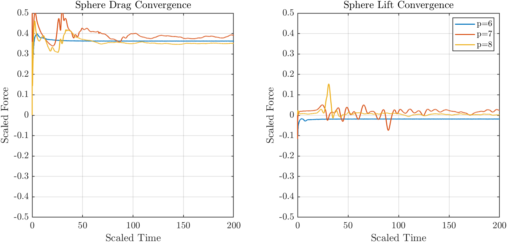
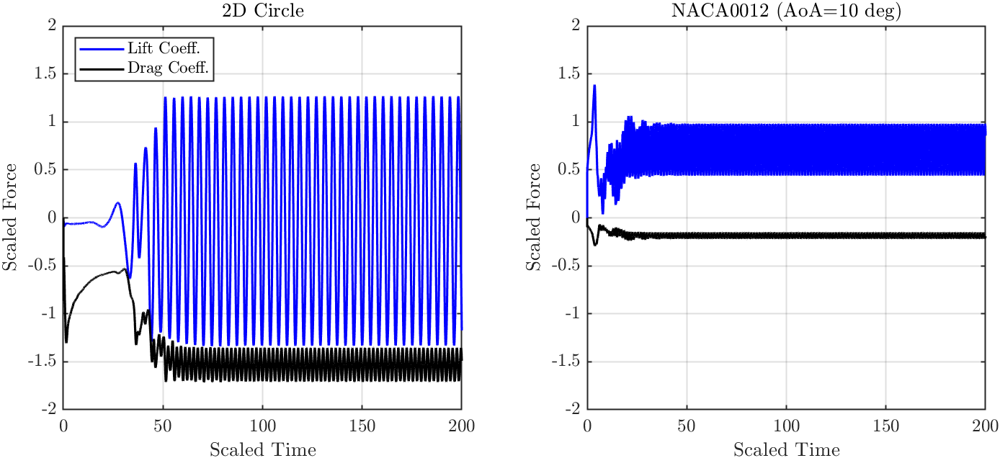
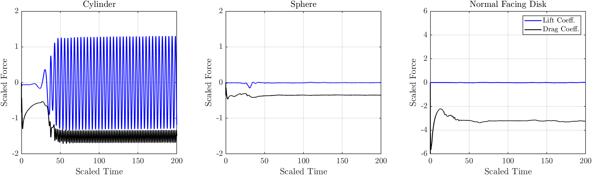
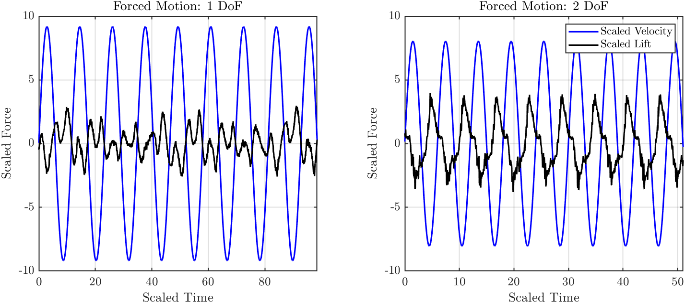

# This work was done using the open source CFD model [WaterLily](https://github.com/weymouth/WaterLily.jl)

## Introduction 
Simulation approaches to fluid structure interaction problems such as flow over a cylinder or sphere, often require calculations of the force experienced on the modeled geometry, imposed by the fluid. The flow model WaterLily, written in the Julia programming language, previously ran exclusively on the CPU, but recent milestones in its development as well as improvements made to Julia have led to support for GPU processing which is considerably faster computationally than CPU processing. The verified force routine originally developed for WaterLily utilized discrete scalar indexing as a means to map pressure elements to their respective area elements on the modeled geometry. GPU processing however does not run efficiently with this type scalar indexing so a new routine was developed to accompany the GPU processing of WaterLily, while remaining sufficiently general enough to still run on a CPU if a GPU is not present. Force validation is done by computing scaled lift and drag forces on commonly accepted, well studied, canonical 2D and 3D geometries such as a circle, cylinder, sphere, normal facing disk plate, and a NACA0012 airfoil. Geometries with moving boundaries are also verified in this work for problems involving forced motion of a cylinder for both 1 and 2 degrees of freedom. With the exception of the dynamic boundary cases, a Reynolds number of 10,000, was used for all geometries and the results are compared to measured and or direct numerical simulation (DNS) data of these geometries. The results of this study show that the new force routine with GPU processing agrees very well with measured and DNS results, reinforcing that this force routine is sufficient for all 
arbitrary geometries.

  

  

WaterLily is a computationally very fast flow solver written in Julia, capable of solving the unsteady Navier-Stokes equation and pressure Poisson equation on a 2D or 3D Cartesian grid [17]. The model utilizes a Boundary Data Immersion Method (BDIM) developed by Weymouth and Yue [8] which allows for combining the fluid equations with the body equations analytically in to a single meta equation. This approach evaluates the fluid structure interaction effects via convolution through the distance between the body and flow as a means of a weighting function. The method itself is verified to second order accuracy through studies of canonical flow problems such as Poiseuille flow.

WaterLily is able to be initialized and run with a set of fully non-dimensional parameters, allowing for scaling across any modeled dimension. The domain size is set up by defining an effective resolution which will be described as $n=2^p$. This value of $n$ is used as a reference for defining the 2 or 3 dimensional lengths of the domain, and can also be used to easily scale the body geometry's characteristic length. In this paper, with the exception of the airfoil, all modeled geometries have a radius $r$, which can be defined as $r=n/20$. With the lengths of the domain characterized, the flow must also now be described, which can be done by a characteristic free stream flow velocity, and a Reynolds number. With the way that the model is set up with everything being dimensionless, it is convenient to use $U=1$ as the flow velocity scale and then govern the flow by the kinematic viscosity as described by $\nu=U\cdot r/Re$.

Defining the body geometry itself in WaterLily is done by a signed distance function (SDF), and a "map" function for translating and rotating. Briefly, an SDF is a general formula for quickly calculating the shortest distance from an arbitrary point $P$ in space, to the nearest point found on the body. The simplest case of this is a circle which is translated to the center of a 2D domain, as shown in the figure below.

$$sdf_{circle}(\vec{x},t) = \sqrt{P_x^2 + P_y^2} - r$$

$$map_{center}(\vec{x},t) = [P_x, P_y] - [c_x, c_y]$$

  

SDFs can be extended to 3D geometries by adding a third dimension and because of how WaterLily is designed, the fluid structure interaction calculations easily adapt. By combining SDF equations such as ellipses, planes, and line segments, complex geometries can be set up and with the the mapping function, they can experience forced motion, or even a free vibration response.

## Force Calculation
The force calculation in WaterLily, fundamentally, computes a surface integral about the body by summing all of the pressure values on the body geometry multiplied by their respective discretized areas (or line segments if in 2D). The gradient is then used to project the force to its vector components as a means to observe lift and drag independently. The generalized analytic equation of this is shown in equation the below equation, where $\Omega_b$ is the arbitrary body, $p$ is pressure, $\hat{n}$ is the gradient unit vector, and $\vec{x}_b$ is a discrete point on the body.

$$\vec{f} = \oint_{\partial\Omega_b}p(\vec{x}_b)\hat{n}(\vec{x}_b)d\vec{x}_b$$

The previous version of this force routine ran by cycling through every point in the domain and finding values that lie on the geometry boundary by searching for SDF values between -1 and 1. If that criteria was met, that point was used to calculate the gradient on the body via the SDF, and then multiplied by the pressure at that point. Because of the BDIM methods functionality, a convolutional kernel is also evaluated with the signed distance to compensate for the layer in between the body and the fluid. This kernel integration is shown in the equation $\mathcal{K}(d)$ below, where $d$ is the SDF distance. This function is very convenient for general processing in this case, because by clamping the signed distance between -1 and 1, all points larger than that will result in zero force during the integral calculation.

$$\mathcal{K}(d) = \frac{1}{2}+\frac{1}{2}\cos{(\pi d)}$$

Because of the way the previous force routine loops through every discrete point in the domain to calculate the signed distance to the geometry, it is not ideal for GPU processing, however it is difficult to avoid scalar indexing for a calculation such as this. Using a Julia package [KernelAbstractions.jl](https://github.com/JuliaGPU/KernelAbstractions.jl), GPU-like kernels can be developed (_i.e._, high throughput processing designed for parallel, accelerated processing) which in this case allows for scalar indexing suited for GPU processing to be done fast and efficiently [15]. The new force routine works by first computing the gradient multiplied by the kernel integration distance at every point in the domain, resulting in an array the size of the full domain where points that do not lie on the geometry boundary are 0. Then this array is simply multiplied by the array containing pressure at every point in the domain, and finally a summation is run to achieve the force components. Steps 1 and 2 of this algorithm utilize the _KernelAbstractions_ package for fast and efficient GPU indexing, with no hindrance to CPU processing if a GPU is not present.

## Methodology
In order to calculate the forces of the previously mentioned geometries in WaterLily, the domain must be set up as well as the geometries themselves. First the domain will be set up by defining an effective spatial resolution building block, $n=2^p$, where in this study $p=8$ is used. The domain can then be set up as integer multiples of $n$. The domain is set to be $(x,y,z)=(2n,n,n)$ allowing for adequate wake formation downstream, as well as enough lateral distance to neglect any wall effects. The increased length in the $x$ direction is not necessary for the force calculation because the outlet is already sufficiently far away from the body itself, but it serves as a means to simultaneously verify the wake formation to ensure the fluid structure interactions are behaving in a realistic and expected manner. The boundary conditions imposed on this domain are Neumann at the inlet, free convection at the output, no-slip on the body, and slip with no penetration on all of the walls. For the case of the 3D cylinder however a periodic boundary condition is implemented on the top and bottom of the $z$ direction as a means to mitigate coalescing flow effects where the cylinder meets the domain which would skew the forces. 

The defined $n$ can then be used to define the characteristic length of all modeled geometries. For everything except the airfoil, $L=n/20$ is used. The airfoil however, needs a larger domain to mitigate wall effects so that will use $L=n/40$. For reference, in the case of the circle if $L$ serves as the circle's diameter, this allows approximately 13 grid points per diameter. An example of the computational domain using a static cylinder is shown in figure below. Lastly, the time vector for the simulation to run is set to run from 0 to 200 scaled time units, with the step size being 0.05 allowing for 4000 time steps for a single simulation. Through convergence testing in WaterLily on a static circular cylinder, these spatial and temporal resolutions showed to have diminishing returns at more refined values than these.

  

As described in the previous section, in order to set up geometries in WaterLily, SDFs must be defined. The SDFs used are defined below. For cylindrical geometries, the aspect ratios used in this study are chosen to be the same as the model data used to achieve the expected results in order to make a more direct comparison. It should be noted that the circle and cylinder SDFs are written as exactly the same but the difference is that in a 2D domain, there is no extrusion and in a 3D domain, the span will be the height of the domain.

  

## Convergence Testing
There is a trade space between computational expense and the accuracy of the results which once defined, acts as the point just before diminishing returns or accuracy are achieved. In order to justify the resolution used for these simulations, incrementally refining the effective grid resolution, relative geometry sizes, and time step must be done. Because of the differences in geometry of this study, convergence can be achieved at different resolutions depending on the body being modeled, which is especially true for the moving geometries for forced motion. The criteria for static geometry convergence is set to a non-zero steady mean lift coefficient and a steady drag coefficient that does not change significantly from the previously tested resolution. The moving geometries adhere to the same criteria, but also are subject to phased force coefficient convergence similar to drag. These terms are described in more detail in the next section. Lastly, although each individual simulation may converge at a slightly different resolution, whichever requires the most refined grid will set the grid for every simulation as a means to make them more directly comparable. The domain size and relative geometry size are shown in the previous section, but for reference, lets call the $y$-direction $n$, so $n=20D$ and $D=n/20$ and the $z$-direction is $10D$. The time step convergence is shown in the figure below, but for convenience, the final value used in this study is $\Delta tU/D=$ 0.005.

  

A sample result from the convergence testing on the sphere is shown above. As the grid resolution increases, the lift coefficient shows to converge to about 0 which is expected and the drag coefficient converges to approximately 0.35 which is also reasonable. At the lower resolutions the results appear to be more steady but they are converging to poor values in terms of accuracy relative to measured data. As the grid cubes become more refined, the construction of the sphere becomes closer to being a curved surface like a sphere actually is. With a coarse resolution the sphere is modeled as being somewhat jagged and the resulting pressure force will not be accurate because of that.

## Forced Motion Vortex Induced Vibrations
Because WaterLily is a CFD model, it is important to not only take into account the static problems but also the dynamic problems. In engineering design almost every problem is dynamic in some way and vibration poses a huge design factor for underwater structures and bodies. Although free vibration is what a body would actually experience from vortex induced vibrations, using prescribed motion has been validated by many independant researchers [2,3,6,7,12] and is much more natural for the current version of WaterLily. Forced motion is a technique originally presented by Sarpkaya which uses the lift and drag coefficients calculated by a 1 degree of freedom (DoF) motion experiment with a prescribed motion amplitude and frequency to then iteratively predict the response of the free vibrating body [1]. More simply put, forced motion is an approximateion to free vibration with the advantage being the ability to capture a more refined motion space to identify forces the body experiences. This has proven to also be an effective technique for 2 DoF which was studied by Dahl and Aktosun [14] but to introduce the concept, only the 1 DoF problem will be used to describe the technique in this section. The forced motion is governed by by 2 dimensionless parameters which are the reduced velocity $V_r$, and cross flow (CF) amplitude $A_y*$. In higher DoF motion there would be motion in the other directions as well, and phase offsets between the various motion frequencies. These terms are defined below where $U$ is the free stream velocity, $f$ is the frequency of motion, $L$ is the characteristic length which in this case is the cylinder diameter, and $A$ represents the amplitude of motion in either direction.

$$V_r = \frac{U}{fL}$$

$$A_y^* = \frac{A_y}{L}$$
    
The problem can be modeled as an oscillating damped spring mass system such as what is shown in below where the motion and lift force are described by:

$$y = A_y\sin{(\omega t)}$$

$$F_L = F_y\sin{(\omega t + \theta)}$$

where in this case, $\theta$ is the phase offset between the motion of the body and the force acting on the body. The phase offset $\theta$ between the forces and the motion is different than the phase offset, $\phi$ between the CF and IL frequencies of motion. This simple example of the damped spring mass system is known to be a second order, ordinary differential equation (ODE) which there are numerous techniques to solve.

  

Using the sum and difference trigonometric identity, the lift equation can be expanded as follows:

$$F_L = F_y\sin{(\omega t)}\cos(\theta) + F_y\cos{(\omega t)}\sin(\theta)$$

This expansion of the sinusoidal lift force decomposes the force into 2 components: lift in phase with velocity, and lift in phase with acceleration, as shown below. 

$$C_{Lv} = C_L\sin{\theta}$$
    
$$C_{La} = C_L\cos{\theta}$$

Assuming $C_{Lv}$ is a measure of fluid excitation from the body and $C_{La}$ is related to an effective added mass, using the general form of a second order ODE for a spring mass damper system ($m\ddot{y}+b\dot{y}+ky=F$), these phased force terms can be substituted and solved analytically. This derivation was given in detail by Sarpkaya [1], and Khalak and Williamson [3] in their work studying forced motion experiments. These phased forces can be calculated in multiple different ways, but in this study an inner product technique derived by Smogeli shown below will be used [4]. This technique is essentially cycle averaging the cycles between lift and motion, resulting in no need for Fourier transformations.

$$C_{Lv} = \frac{1}{N}\sum_{i=1}^N \sqrt{\frac{2}{T_i}}\frac{\langle C_{Li}(t),\dot{y}_i(t)\rangle}{\sqrt{\langle\dot{y}_i(t),\dot{y}_i(t)\rangle}}$$

$$C_{La} = \frac{1}{N}\sum_{i=1}^N \sqrt{\frac{2}{T_i}}\frac{\langle C_{Li}(t),\ddot{y}_i(t)\rangle}{\sqrt{\langle\ddot{y}_i(t),\ddot{y}_i(t)\rangle}}$$

Because these forced motion studies have been repeated experimentally so many times, there are data sets and repeated results providing these phased force coefficients that can be used as a direct comparison with the simulated results in this study. For 1 DoF motion, data from Morse and Williamson, and for 2 DoF motion, data from Aktosun is used.

## Results
In order to justify the claim that the forces calculated by this model and routine are accurate and valid, they must be directly compared to data that has been repeatedly studied by independent research groups and can be considered to be correct. Many of these geometries are common enough where their lift and drag coefficients for a plethora of Reynolds numbers can be found in academic textbooks, and there are verified empirical relations to determine their forces as a function of Reynolds number. The expected lift and drag values for these geometries and their sources are shown in the table below, and the expected linear phased forces are shown in table below that.

| Geometry | $$C_L$$ | $$C_D$$ | Source |
| :------: | :-----: | :-----: | :----: |
| 2D Circle | 0 | 1.00-1.50 | Newman Hydrodynamics [11]|
| 2D NACA0012  $$AoA = 10&deg$$ | 0.70-0.80 | -- | Yamaguchi [13]|
| Circular Cylinder | 0 | 1.00-1.50 | Newman Hydrodynamics [11]|
| Sphere | 0 | 0.30-0.50 | Newman Hydrodynamics [11]|
| Normal Facing Thin Disk | 0 | 3.0-4.0 | Clift [5]|

| Geometry | $$C_{Lv}$$ | $$C_{EA}$$ | Source |
| :------: | :-----: | :-----: | :----: |
| 1 DoF Forced Motion Cylinder  $$Vr=5.0, Ay/D=0.4, Re=4000$$ | 0.00-0.80 | -0.6-0.0 | Morse [7]|
| 2 DoF Forced Motion Cylinder  $$Vr=6.0, Ay/D=0.6, Ax/D=0.2, \phi=-180&deg, Re=7620$$| -1.67--2.50 | 1.65-2.40 | Aktosun [14]|

## Source Experimental Details
Although all of these experiments have been independently repeated and studied for decades such as the static cylinder, sphere, and normal facing disk, some of these experiments require further explanation to further justify the comparisons being made in this study. The less conventional experiments in which data was used in this study will be briefly described in this section before presenting the simulation results from WaterLily. With the exception of the airfoil, all measured experiments were done in a tow tank but it is important to describe the respective setups to further validate the simulation setup and decisions used here.

Yamaguchi et al. [13] investigated improving the performance of a NACA0012 wing in a relatively low Reynolds number regime of 10,000 - 60,000 for angles of attack (AoA) between 0 and 30 degrees. A high resolution finite volume software was also used to validate the experimental approach. The proposed improvement is adding a leading edge protuberance (LEP) which was implemented as a sinusoidal wave along the extruded dimension. The LEP is not relevant to this study, nor was it modeled in WaterLily. In order for this group to justify their proposed improvements to the wing performance, a baseline measurement must be taken which they used an Eiffel-type wind tunnel for. The wing itself was 3D printed with a span length of 100mm and a chord length of 55mm. The domain in which the wing was placed in was measured as 1000mm in length and 500mm in width and height. Data was collected at Reynolds numbers of 10,000, 20,000, 43,200, and 60,000 and 16 different AoA between 0 and 30 degrees. Their objective was to observe the improvement in passive separation control on the wing, but because their baseline data agreed well with 2D simulation results similar to WaterLily, a single AoA data point at $Re$=10,000 was chosen to serve as a comparison in this study.

For the 1 DoF forced motion study conducted by Morse and Williamson [7], a relatively small tow tank was used with a cylinder of submerged span length equal to 10 diameters. The tank width was 10 diameters wide, and the length downstream is sufficiently long enough for 100 cycles of motion to be captured at the lowest oscillation frequencies ($V_r$=16). This was an exceptionally high resolution data set with their results presenting a detailed grid of wake regimes and phased force contours describing the response branch behavior and transition properties as the motion crosses over wake regimes. For use in this study, an arbitrary point was selected in one of the wake regimes and the phased forces were analyzed. Future work with WaterLily will present a more detailed investigation into simulation approaches to observe the other wake regimes and response branches, but that level of detail is not relevent for validating the force routine.

The 2 DoF forced motion study done by Aktosun and Dahl [14] ran similar studies to Morse and Williamson but added IL motion to the parameter space. Because of how many possible combinations there are with 2 DoF motion parameters, this data set when compared to Morse's is low resolution. However, compared to what has been done previously with 2 DoF motion studies this is actually a very high resolution data set. The tow tank setup used was approximately 28 diameters wide and 104 diameters long, where the cylinder had a submerged length of 10 diameters. Compared to the tank Morse used, this tank is wider however much shorter in length allowing for less cycles of motion. Despite this shorter length and limited number of cycles, previous work by Reilly-Collette and Dahl [9] using the same tank, showed repeatable results matching 1 DoF data from Morse and Williamson so this tank should be considered a sufficient size for this type of study. Similarly to the 1 DoF data, 1 motion combination was arbitrarily chosen to model in WaterLily for direct comparison.

## 2D Geometries

  

The magnitudes of the average lift and drag coefficients for the 2D circle as shown above are approximately 0 and 1.36 respectively. This agrees very well with the reference data set as shown in the tables from previous sections. This is also in agreement with what a cylinder would experience which makes sense for this problem assuming the pressure distribution is uniform on its body which would then cancel with the extra scaling term to account for the span length. The NACA0012 was run for a very low Reynolds number relative to studies that usually look at geometries such as this. However, the lift coefficient of approximately 0.75 is in agreement with the reference dataset which ran experimental studies the same geometry. Drag was not included in this figure because the reference data only discussed lift. As more reference datasets for this type of work are found, this will be updated accordingly. 

## 3D Static Geometries
There are three, 3D static geometries modeled in this study: sphere, circular cylinder, and a disk normal to the direction of flow. 

  

Data from both of these geometries show to effectively converge at a scaled time value of approximately 50 where the mean lift coefficients show to be 0, and the drag coefficients show to be -0.35 and -1.50 for the sphere and cylinder respectively. Both of these values are within the ranges of expected values for these geometries for a Reynolds number of 10,000, referenced in tables from the previous section. The disk experiences significantly more drag than the other 2 geometries which is expected due to the projected area facing the flow being much larger. The lift is zero due to it's symmetry and the drag coefficient is approximately 3.5 which agrees with measured data presented in the reference from Clift [5]. From looking exclusively at the time series data, it can be inferred that the wake of the sphere and disk has less of an asymmetric behavior than the cylinder because of the large relative amplitudes of the lift and drag seen in the cylinder data. Despite the more intense oscillatory behavior from the cylinder force data, the forces still become steady and consistent fairly quickly. 

## 3D Dynamic Geometries
There are two cases of circular cylinders modeled with dynamic boundaries in this study: 1 Degree of Freedom (DoF) motion perpendicular the free stream (cross flow or "CF") and 2 DoF motion which is both CF and parallel to the free stream (inline or "IL"). The motion parameters used for the 1 DoF data are $V_r=5$ and $A_y^\*=0.4$ and the motion parameters used for the 2 DoF data are $Vr=6$, $A_y^\*=0.6$, $A_x^\*=0.2$, and $\phi=-180^{\circ}$. Adding IL motion to the simulation significantly increases the amount of possible motion combinations, so in order to simplify this, a frequency relationship between the two directions is imposed. The relationship is set somewhat arbitrarily as the IL motion frequency is 2 times the CF motion frequency.

  

Both plots show the velocity of the moving boundary as well as the corresponding lift force. The lift force shows to be well synchronized with the motion which leads to the accuracy of the phased force coefficients. The 1 DoF motion simulation gives values for $C_{Lv}$ and $C_{EA}$ of -0.8 and 0.0 respectively which is essentially exact when compared to Morse and Williamson's measured data. The 2 DoF simulation also shows similar accuracy to the reference data however that data set is far more coarse so the range of correctness is wider. The values of $C_{Lv}$ and $C_{EA}$ are -1.68 and 1.61 which, similarly to the 1 DoF data, agrees with the reference data set.

## Discussion and Conclusions
To summarize the present study, a force routine capable of high performance with GPU processing was developed for the Julia flow model WaterLily and has been validated by comparing scaled force coefficients to measured data and high resolution independent simulations. Canonical problems such as flow over a circular cylinder and sphere were modeled as they are very well studied and show consistent results over decades of repeated experiments from independent researchers. WaterLily showed to agree well with force coefficients for both static boundaries as well as dynamic boundaries, in the cases presented of the forced motion cylinder. Although there is error presented in the form of not measuring exactly the same forces as experiments, these expected values are somewhat of a range of values due to the nature of experimental measurement. Forces measured become somewhat dependent on the experimental setup due to ambient conditions as well as the experiment set up as well. Because of the consistent agreement with the forces calculated with WaterLily's new force routine to measured data and high resolution numerical data, when relevant, this force routine can be considered sufficiently accurate for all arbitrary geometries. One limitation not presented in this study are forces at very high Reynolds number flows such as $Re=10^6$. This type of study would require the investigation into a wall model implementation. Based on the results of this study and previous work on developing the BDIM method, the upper limit of Reynolds number for this method is approximately $10^5$ [10]. Another limitation not presented here is resolution convergence, such as with high frequency and high amplitude moving boundaries. Both cases for dynamic boundaries discussed in this study used fairly moderate reduced velocities and amplitudes which showed good force results at the temporal and spatial resolution used in WaterLily. However, as the motion becomes more intense high resolutions and possibly larger geometries may become necessary to achieve the same levels of accuracy. With the accuracy WaterLily's force routine, future work with this model can include problems such as free vibration response, using the force at each time step to calculate a reaction force on the freely moving geometry.

## References
[1] Turgut Sarpkaya. “Transverse oscillations of a circular cylinder in uniform flow, part 1. Revised”. In: Technical Report No. NPS-69SL77071 (1977).

[2] Ramnarayan Gopalkrishnan. “Vortex-induced forces on oscillating bluff cylinders”. PhD thesis. Massachusetts Institute of Technology, 1993.

[3] Asif Khalak and Charles HK Williamson. “Motions, forces and mode transitions in vortex-induced vibrations at low mass-damping”. In: Journal of fluids and Structures 13.7-8 (1999), pp. 813–851.

[4] O Smogeli. “Design and evaluation of a force-feedback control system for VIV experiments”. In: NTNU and MIT (2002).

[5] Roland Clift, John R Grace, and Martin E Weber. “Bubbles, drops, and particles”. In: (2005).

[6] Jason Dahl. “Vortex-induced vibration of a circular cylinder with combined in-line and cross-flow motion”. PhD thesis. Massachusetts Institute of Technology, 2008.

[7] TL Morse and CHK Williamson. “Prediction of vortex-induced vibration response by employing controlled motion”. In: Journal of Fluid Mechanics 634 (2009), pp. 5–39.

[8] Gabriel D Weymouth and Dick KP Yue. “Boundary data immersion method for Cartesian-grid simulations of fluid-body interaction problems”. In: Journal of Computational Physics 230.16 (2011), pp. 6233–6247.

[9] Marina Iizuka Reilly-Collette. Prediction method of the Vortex Induced Vibration of a one degree-of-freedom spring-mass system. University of Rhode Island, 2014.

[10] Audrey P Maertens and Gabriel D Weymouth. “Accurate Cartesian-grid simulations of near-body flows at intermediate Reynolds numbers”. In: Computer Methods in Applied Mechanics and Engineering 283 (2015), pp. 106–129.

[11] John Nicholas Newman. Marine hydrodynamics. The MIT press, 2018.

[12] Jason Dahl and Erdem Aktosun. “Force and wake observations for a circular cylinder undergoing forced 2-DOF motion in a free stream”. In: APS March Meeting Abstracts. Vol. 2019. 2019, pp. C48–004.

[13] Yuta, Yamaguchi, Ohtake Tomohisa, and Muramatsu Akinori. "1201 PRESSURE DISTRIBUTION ON A NACA0012 AIRFOIL AT LOW REYNOLDS NUMBERS." The Proceedings of the International Conference on Jets, Wakes and Separated Flows (ICJWSF) 2013.4. The Japan Society of Mechanical Engineers, 2013.

[14] Erdem Aktosun, Ersegun Deniz Gedikli, and Jason M Dahl. “Observed Wake Branches from the 2-Dof Forced Motion of a Circular Cylinder in a Free Stream”. In: Available at SSRN 4341395.

[15] Kernel Abstractions: Heterogeneous programming in Julia. Accessed: 2023-09-01. URL: https://github.com/JuliaGPU/KernelAbstractions.jl.

[16] UIUC Airfoil Coordinates Database. Accessed: 2023-09-10. URL: https://m-selig.ae.illinois.edu/ads/coord_database.html.

[17] WaterLily: A Fast and Simple Fluid Simulator Written in Pure Julia. Accessed: 2023-05-01. URL: https://github.com/weymouth/WaterLily.jl
